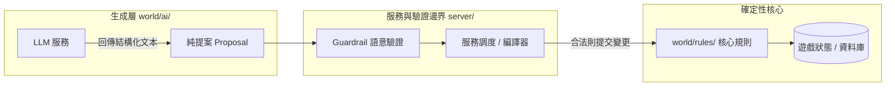

# LLM 核心架構與邊界契約

在《伊洛瑟恩》（Elosern）遊戲引擎中，大型語言模型（LLM）被定位為「非同步的生成提案者」（Asynchronous Generative Proposer）。本文件闡述生成系統的頂層架構、設計哲學、執行期模型以及防護邊界契約。

> [!TIP]
> **快速導航指引**
> * 欲了解具體遊戲場景（如 NPC 對話、公會任務、戰鬥旁白）的調度細節，請參閱 [7 大業務情境與調度流程](/development/llm-scenarios)。
> * 欲了解提案如何經過嚴格格式校驗、語意過濾與數值防洩漏，請參閱 [護欄天梯與語意驗證機制](/development/llm-guardrails)。
> * 欲配置 API 端點（Ollama、vLLM、OpenRouter）與 23 個 Knobs 參數，請參閱 [端點配置與模型調優指南](/development/llm-configuration)。
> * 欲檢視或調整提示詞（Prompt）模板，請參閱 [提示詞資料庫](/gm/prompts)。

---

## 兩大架構鐵律

整個生成架構由兩條不可撼動的系統鐵律所主導：

### 1. 單一寫入者原則（Single-Writer Boundary）



* **提案與寫入嚴格分離**：`world/ai/` 內的所有模組均為**唯讀且僅能產出提案（Proposal-only）**。生成層嚴禁直接修改遊戲實體、型別物件（Typeclass）、屬性或資料庫。
* **確定性核心是唯一權威**：所有遊戲狀態（包含角色數值、金錢、背包、任務進度、好感度等）的實質變更，必須由確定性核心套件（主要為 `world/rules/`，以及各自管理持久狀態的 `world/maps/` 與 `world/quests/`）執行。
* **合約測試強制保障**：儲存庫架構測試（`tests/test_ai_transport_contract.py`）會嚴格掃描程式碼匯入路徑，禁止 `world/ai/` 直接匯入任何狀態寫入者（State Writer）。跨系統的橋接一律由 `server/` 目錄下的服務層承擔。

### 2. 確定性離線可玩性（Offline-Playable Invariant）

* **零網路依賴性**：遊戲引擎在所有外部 LLM 服務、圖像生成服務或網路全部中斷時，仍必須保持 100% 可玩。
* **必定優雅降級**：當遇到 API 逾時、連線失敗、伺服器錯誤、輸入資料超長、或者模型輸出無法通過語意驗證時，各生成層絕不會拋出未捕獲例外（Unhandled Exception）中斷遊戲，而是必然降級為確定性的本地回退（Fallback）邏輯（例如手寫範本池、預設問候語或基礎字串渲染）。

---

## 系統拓撲與模組職責劃分

整個 LLM 支援體系在程式碼中分為四大層次：

```text
prompts/                         # 唯一的外部提示詞資料夾（YAML 格式，熱重載生效）
├── narrator.yaml
├── npc_dialogue.yaml
└── ...
world/prompts/                   # 提示詞驗證與註冊表（唯讀契約、白名單占位符保護）
world/ai/                        # 生成提案層（無狀態、無副作用、Twisted 非同步驅動）
├── client.py                    # OpenAI 相容非同步 HTTP 用戶端（OpenAICompatClient）
├── profiles.py                  # 7 大層級的不可變設定檔（LLMProfile）
├── guardrail.py                 # 驗證-重試-降級核心防護管線
├── narrator.py                  # 旁白散文生成
├── npc_dialogue.py              # NPC 對話與行為意圖生成
├── scenario_director.py         # 任務藍圖生成
├── scene_flavor.py              # 場景氛圍段落生成
├── character_creation.py        # 角色創角提案生成
├── action_options.py            # 探索卡片建議生成
└── title_nomination.py          # 異名選票提案生成
server/                          # 服務整合與雙向匯入邊界
├── ai_director_service.py       # 任務生成與創角提案服務
├── option_proposal_service.py   # 行動建議卡片調度與快取服務
├── scene_flavor_service.py      # 場景氛圍排程服務
└── title_nomination_service.py  # 稱號異名提名排程服務
```

### 1. 外部提示詞資料庫（`prompts/` & `world/prompts/`）
* 所有系統與使用者 Prompt 範本集中於 `prompts/*.yaml`，管理員調整提示詞毋須修改 Python 程式碼，亦毋須重新建置容器映像檔。
* `world/prompts/registry.py` 定義了嚴格的白名單占位符（Allowed Placeholders）與長度上限。未授權的變數置換會在載入時立即報錯，阻斷潛在錯誤。

### 2. 生成提案層（`world/ai/`）
* **無直接連線建立**：所有生成函式（如 `narrate_event_logs`、`generate_npc_reply`）均採依賴注入（Dependency Injection）方式傳入 `client`，模組內部不得在全域範圍建立 Socket 或連線。
* **純粹的資料轉換**：輸入為不可變的上下文（Context），輸出為凍結的提案資料類別（Frozen Dataclass）或純字串。

### 3. 服務整合層（`server/`）
* 由於程式碼架構契約嚴格限制匯入方向（`world/rules` 不得碰 `world/ai`，反之亦然），`server/` 是少數被允許同時匯入兩端的黏合層。
* 負責協調非同步 Deferred、在交易提交鉤子（`transaction.on_commit`）觸發生成、快取生成結果、並呼叫規則層寫入狀態。

---

## 執行期非同步調度模型

Evennia 運行於 Twisted 非同步事件迴圈之上。為了防止長時間的模型推論阻塞遊戲主迴圈，LLM 調度遵循以下原則：

1. **非同步 Deferred 管道**：
   `world/ai/client.py` 封裝 Twisted 的 `Agent` 與 HTTP 連線池，實作 `OpenAICompatClient`。所有網路呼叫皆回傳 `defer.Deferred`，完全不佔用主執行緒。
2. **交易後提交觸發（Post-Commit Triggering）**：
   對於因為玩家移動或狀態變更所引起的 LLM 請求（如移動進房觸發行動卡片計算、通關觸發異名提名），一律透過 `transaction.on_commit` 排程，確保資料庫實質提交後才向外部發送請求，避免交易回滾導致幽靈請求。
3. **即時思考回饋（UX 體驗）**：
   在等待 LLM 回應的延遲期間（如 NPC 對話），系統利用 `twisted.internet.task.deferLater` 在達到預設延遲門檻後發送思考提示訊息（`npc.thinking`），並於收到回應時及時取消，確保玩家能感知 NPC 正在思考。

---

## 相關延伸閱讀

* 深入探索各遊戲模組如何發起與使用生成內容：[7 大業務情境與調度流程](/development/llm-scenarios)
* 了解防止數值幻覺與過濾敏感資訊的機制：[護欄天梯與語意驗證機制](/development/llm-guardrails)
* 配置各層獨立模型、API 密鑰與請求逾時：[端點配置與模型調優指南](/development/llm-configuration)
