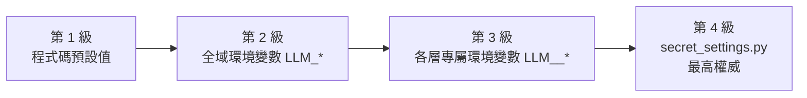

# LLM 端點配置與模型調優指南

本手冊面向系統維運者與核心開發者，說明如何配置《伊洛瑟恩》遊戲引擎的 LLM 連線端點、調整推論超參數、以及為不同生成層指派專屬模型。

> [!TIP]
> **快速導航指引**
> * 欲了解 7 個生成層的業務背景與呼叫時機，請參閱 [7 大業務情境與調度流程](/development/llm-scenarios)。
> * 欲了解核心防護網與重試預算，請參閱 [護欄天梯與語意驗證機制](/development/llm-guardrails)。
> * 欲編輯提示詞文字，請參閱 [提示詞資料庫](/gm/prompts)。
> * 欲查閱包含美術生成（Stable Diffusion）等全域環境變數，請參閱 [設定與環境變數](/development/settings-and-environment)。

---

## 三層配置模型與優先順序

系統採用嚴格的宣告式配置架構，所有參數由 `server/conf/llm_knobs.py` 統一管理，解析結果於開機時注入不可變的 `LLMProfile`。



### 優先次序說明
1. **程式碼預設值**：`server/conf/settings.py` 中定義的基準值。
2. **全域環境變數（`LLM_<SUFFIX>`）**：適用於所有未特別指定之層級。
3. **分層專屬環境變數（`LLM_<LAYER>_<SUFFIX>`）**：覆寫單一層級的參數。`<LAYER>` 為 7 大層級名稱之大寫（保留底線，例如 `LLM_SCENARIO_DIRECTOR_MODEL`）。
4. **`server/conf/secret_settings.py`**：最高裁決者，永遠覆寫環境變數。推薦將敏感的 API 密鑰保留於此處。

### 嚴格閉合失敗語意（Fail-Closed）
若環境變數存在但提供無效格式（例如在浮點數字段傳入英文字串、或數值超出上下限），系統會在**開機時立即丟出 `ImproperlyConfigured` 並中止程序**，點名出錯的變數名稱與規則。系統絕不會靜默忽略錯誤或自動退回預設值。

---

## 23 個宣告式 Knobs 字典

每個生成層級皆支援以下 23 個細部微調參數：

### 1. 網路傳輸與連線認證

| 變數後綴 (`<SUFFIX>`) | 型別 | 預設值 | 說明 |
| :--- | :---: | :---: | :--- |
| `BASE_URL` | URL 字串 | `http://127.0.0.1:11434` | OpenAI 相容 API 根位址（Compose 容器內預設為指向宿主機網關）。 |
| `PATH` | 字串 | `/v1/chat/completions` | Chat Completions 端點路徑。 |
| `TIMEOUT_SECONDS` | 整數 | `60` | 單次 HTTP 請求的牆鐘截止秒數（正整數）。 |
| `API_KEY` | 字串 | 空（未設定） | 認證 Bearer Token。非空時自動附帶 `Authorization: Bearer <KEY>`。 |
| `APP_TITLE` | 字串 | 空（未設定） | OpenRouter 統計用識別標頭（`X-Title`）。 |
| `APP_URL` | 字串 | 空（未設定） | OpenRouter 統計用來源網址（`HTTP-Referer`）。 |
| `ENABLED` | 布林 | `True` | 是否啟用此層。設為 `False` 則直接走離線降級路徑，不發送任何請求。 |
| `MAX_RETRIES` | 整數 | `2` | 驗證失敗時的最大重試次數（0～10）。 |

### 2. 模型與取樣超參數

| 變數後綴 (`<SUFFIX>`) | 型別 | 預設值 | 說明 |
| :--- | :---: | :---: | :--- |
| `MODEL` | 字串 | `llama3.2` | 呼叫的模型標籤或名稱。 |
| `TEMPERATURE` | 浮點數 | `0.7` | 採樣溫度（0.0～2.0）。數值愈低愈穩定，愈高愈具隨機創造力。 |
| `MAX_TOKENS` | 整數 | 視層級而定 | 回傳最大 Token 數（一般層預設 250，`action_options` 為 320，`title_nomination` 為 640）。 |
| `MAX_COMPLETION_TOKENS` | 整數 | 省略 | 若設定此值，將取代 `max_tokens` 傳出（OpenAI 新版 API 相容）。 |
| `TOP_P` | 浮點數 | 省略 | 核採樣機率閾值（0.0～1.0）。 |
| `TOP_K` | 整數 | 省略 | Top-K 採樣限制（正整數）。 |
| `FREQUENCY_PENALTY` | 浮點數 | 省略 | 頻率懲罰係數（-2.0～2.0）。 |
| `PRESENCE_PENALTY` | 浮點數 | 省略 | 存在懲罰係數（-2.0～2.0）。 |
| `REPETITION_PENALTY` | 浮點數 | 省略 | 重複懲罰係數（> 0.0）。 |
| `MIN_P` | 浮點數 | 省略 | 最小採樣機率（0.0～1.0）。 |
| `TOP_A` | 浮點數 | 省略 | Top-A 採樣係數（0.0～1.0）。 |
| `SEED` | 整數 | 省略 | 隨機種子碼（整數），供可重現性除錯。 |

### 3. 推理與進階控制

| 變數後綴 (`<SUFFIX>`) | 型別 | 預設值 | 說明 |
| :--- | :---: | :---: | :--- |
| `REASONING_EFFORT` | 選擇 | 省略 | 思考強度，可選值：`minimal`、`low`、`medium`、`high`。 |
| `REASONING_STYLE` | 選擇 | `off` | 推理格式封裝：`openrouter`（嵌套物件）、`vllm`（`chat_template_kwargs`）、`off`（不傳送）。 |
| `SUPPORTS_RESPONSE_FORMAT` | 布林 | 視層級而定 | 是否支援結構化 JSON 輸出（`action_options` 強制要求 `True`）。 |

---

## 多模型分工配置策略（Multi-Model Strategy）

各業務情境對延遲與推論能力的要求截然不同。建議透過環境變數實現「大模型負責複雜規劃、小模型負責即時互動」的分工：

```ini
# ==============================================================================
# 全域基準配置（本機 Ollama 輕量模型）
# ==============================================================================
LLM_BASE_URL=http://127.0.0.1:11434
LLM_MODEL=llama3.2:3b
LLM_TEMPERATURE=0.7

# ==============================================================================
# 任務企劃導演（ScenarioDirector）：需要強大的邏輯推理與 Schema 遵循能力
# ==============================================================================
LLM_SCENARIO_DIRECTOR_MODEL=qwen2.5:32b
LLM_SCENARIO_DIRECTOR_TEMPERATURE=0.3
LLM_SCENARIO_DIRECTOR_TIMEOUT_SECONDS=120

# ==============================================================================
# 行動建議卡片（ActionOptions）：要求極低延遲與穩定 JSON 輸出
# ==============================================================================
LLM_ACTION_OPTIONS_MODEL=qwen2.5:7b
LLM_ACTION_OPTIONS_TEMPERATURE=0.2
LLM_ACTION_OPTIONS_TIMEOUT_SECONDS=15

# ==============================================================================
# NPC 對話（NPCDialogue）：要求豐富的情感表達與台詞文采
# ==============================================================================
LLM_NPC_DIALOGUE_MODEL=qwen2.5:14b
LLM_NPC_DIALOGUE_TEMPERATURE=0.8

# ==============================================================================
# 單獨停用某層級（例如開發除錯中，暫時停用場景氛圍描述）
# ==============================================================================
LLM_SCENE_BUILDER_ENABLED=False
```

---

## 常見後端部署設定範例

### 1. 本地 Ollama 部署
Ollama 原生相容 OpenAI API，適用於本地單機開發：

```ini
LLM_BASE_URL=http://127.0.0.1:11434
LLM_PATH=/v1/chat/completions
LLM_MODEL=qwen2.5:7b
```

### 2. 本地 vLLM 高併發實例（含思考推理）
若使用 vLLM 託管具備思考鏈（Thinking/Reasoning）的模型（如 DeepSeek-R1 系列）：

```ini
LLM_BASE_URL=http://127.0.0.1:8000
LLM_MODEL=deepseek-ai/DeepSeek-R1-Distill-Qwen-14B
LLM_REASONING_STYLE=vllm
LLM_TIMEOUT_SECONDS=180
```

### 3. 雲端 OpenRouter 託管
使用雲端 API 時，強烈建議將金鑰保存於 `server/conf/secret_settings.py`，避免暴露於環境變數：

```python
# server/conf/secret_settings.py
LLM_PROFILES = {
    "scenario_director": {
        "base_url": "https://openrouter.ai/api",
        "model": "anthropic/claude-3.5-sonnet",
        "api_key": "sk-or-v1-xxxxxxxxxxxx",
        "app_title": "Elosern MUD",
        "app_url": "https://github.com/your-repo/mud",
    }
}
```

---

## 觀測性與除錯日誌

所有的 LLM 呼叫皆會向結構化監控系統（`world.observability`）發出 `llm_call` 事件。維運人員可在日誌中過濾以下標記以掌握推論效能：

```json
{
  "event": "llm_call",
  "level": "info",
  "context": {
    "layer": "npc_dialogue",
    "profile": "qwen2.5:14b",
    "ms": 1420,
    "result": "ok"
  }
}
```

若發生驗證失敗並觸發降級，日誌會明確記錄 `result: "degraded"` 以及具體的 `reason`。

---

## 相關延伸閱讀

* 了解 7 大層級的業務情境：[7 大業務情境與調度流程](/development/llm-scenarios)
* 了解各層級的驗證天梯與語意防護：[護欄天梯與語意驗證機制](/development/llm-guardrails)
* 查閱完整的環境變數清單：[設定與環境變數](/development/settings-and-environment)
