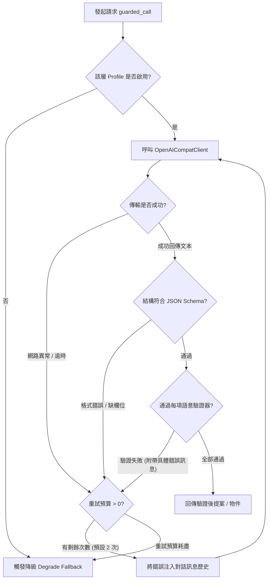

# LLM 護欄天梯與語意驗證機制

由於大型語言模型（LLM）本質上具備隨機性、潛在幻覺以及格式不穩定性，《伊洛瑟恩》在生成層與遊戲規則層之間構築了一套嚴密的防護網——**驗證-重試-降級核心管線（Validation-Retry-Degrade Guardrail）**。

所有來自 LLM 的回應在進入遊戲核心之前，必須通過結構化 Schema 檢查與層層語意驗證天梯。任何不合格的提案皆會被攔截、反饋錯誤並消耗重試預算；若重試耗盡，則無條件觸發確定性降級。

> [!TIP]
> **快速導航指引**
> * 欲了解呼叫護欄管線的 7 大業務場景，請參閱 [7 大業務情境與調度流程](/development/llm-scenarios)。
> * 欲了解防禦邊界與單一寫入者設計，請參閱 [核心架構與邊界契約](/development/llm-architecture)。
> * 欲調整各層重試次數（`MAX_RETRIES`）與逾時設定，請參閱 [端點配置與模型調優指南](/development/llm-configuration)。

---

## 核心管線：驗證-重試-降級流程

核心函式 `world/ai/guardrail.py:guarded_call()` 是所有生成層的唯一入口：



### 重試與錯誤回饋機制
當檢驗未通過時，管線不會單純盲目重新發送相同的 Prompt，而是將**具體的失敗原因（例如「台詞中出現未置換標籤」或「配點總和超出種族上限」）組裝為使用者角色的糾正訊息附加在對話末尾**，讓模型在下一次嘗試中針對錯誤精準修正。

---

## 通用語意驗證器（Semantic Validators）

各生成層在伺服器啟動時，會向護欄註冊一組具名的語意驗證函式（`SemanticValidator: Callable[[Any], list[str]]`）。常見的通用驗證器包括：

### 1. 非空與空白檢查 (`_validate_non_empty`)
* 確保輸出並非空字串、全空白字元或僅包含無意義標點。

### 2. 長度邊界檢查 (`_validate_bounded_length`)
* 針對散文或台詞設定嚴格的字元上限與下限。例如：
  * 場景氛圍散文：必須在 50 到 200 字之間。
  * NPC 台詞：不得超過 2,000 字。
  * 異名稱號：必須在 2 到 8 個字之間。

### 3. CJK 漢字保證 (`_validate_has_cjk`)
* 所有面向玩家的輸出必須確保含有繁體中文常用的 CJK 統一漢字編碼（`\u4e00`～`\u9fff`），防止模型因提示詞漂移而回傳純英文或無效符號。

### 4. 未置換範本標籤攔截
* 透過正規表達式檢測文本中是否殘留任何內部範本占位符（如 `{actor}`、`{target}`、`{data[...]}` 等），杜絕將底層變數語法直接暴露在玩家眼前。

---

## 特殊業務防護機制

除了通用驗證，各業務情境還實作了領域專屬的嚴格防線：

### 1. 探索行動卡片 12 階驗證天梯（Action Options Ladder）

在 `world/ai/action_options.py` 中，建議卡片必須在本地連續通過 12 道順序固定的嚴格關卡（Ladder 0～11）。任何階段失敗，立即終止並對應到該階的專屬拒絕碼：

| 階級 (Stage) | 拒絕碼 (Rejection Code) | 檢驗內容與安全約束 |
| :---: | :--- | :--- |
| **0** | `schema_violation` | 回傳非合法 JSON 或缺少必要結構欄位。 |
| **1** | `card_count_out_of_range` | 卡片數量必須恰好為 3 到 5 張。 |
| **2** | `empty_label` | 卡片標籤（`label`）為空。 |
| **3** | `label_too_long` | 標籤長度超過 24 字元。 |
| **4** | `non_cjk_label` | 標籤未包含正體中文 CJK 漢字。 |
| **5** | `placeholder_label` | 標籤含有未置換的範本標籤。 |
| **6** | `digit_in_label` | 標籤內出現阿拉伯數字（防數值幻覺）。 |
| **7** | `unknown_action_code` | 行動代碼非系統已知指令且非自由發言。 |
| **8** | `no_such_affordance` | **【核心防禦】** 卡片的 `action_code` 必須完全吻合當前房間實際可執行的動作（Affordances）。 |
| **9** | `unknown_target` | 卡片所引用的目標 NPC 或物件不存在於現場。 |
| **10** | `hint_too_long` | 說明文字（`hint`）超過 60 字元。 |
| **11** | `leak_detected` | 標籤或說明中出現內部好感度或真實隱藏屬性數值。 |

### 2. 數值外洩防護（No-leak Secrets）
* **NPC 對話**：NPC 內部好感度（Favor/Disposition）是隱藏數值。若 NPC 在台詞中直接說出「我對你的好感度目前是 65 分」，該台詞將直接被 `_no_leak_validator` 攔截。
* **偽裝屬性（Disguised Stats）**：若玩家裝備了具有「偽裝」效果的道具（例如對外顯示攻擊力 10，真實攻擊力 80），真實數值會被放入 `no_leak_secrets` 集合，防止 NPC 對話意外戳破玩家數值。

### 3. 無數字鐵律（No Fabricated Numbers）
* 在場景氛圍描述（`scene_flavor`）與行動建議卡片（`action_options`）中，**嚴禁出現任何阿拉伯數字**。
* 此規則旨在杜絕 LLM 擅自創造「5 隻哥布林伏擊」、「前方 20 公尺處有懸崖」等未經確定性核心批准的虛構數字。

### 4. 成年人絕對底線（Adult Invariant）
* 《伊洛瑟恩》為成人主題遊戲，系統全面禁止任何未成年角色設定。
* 在創角提案（`character_creation`）中，`age` 與 `apparent_age` 必須 $\ge 18$ 歲。任何低於 18 歲的輸出，將在驗證階段強制被攔截或校正，絕不允許進入遊戲世界。

---

## 結構化輸出與 JSON Schema 登錄

對於需要輸出結構化資料的層次（如 `action_options`、`scenario_director`、`character_creation`、`title_nomination`）：

1. **結構化旗標宣告**：
   該層 Profile 必須宣告 `supports_response_format: True`。若底層模型支援 OpenAI 的 `response_format: { type: "json_object" }`，用戶端將在請求時帶入該標頭。
2. **JSON Schema 登錄表 (`world/ai/schemas/registry.py`)**：
   輸出契約由預先註冊的 Draft-7 JSON Schema 規範。回傳本文首先透過 `jsonschema.Draft7Validator` 校驗型別與必要鍵值，校驗通過後才進入 Python 語意驗證器。

---

## 哨兵（Sentinel）與降級回調架構

為了讓通用護欄能夠在不知道具體業務資料的情況下觸發降級，系統採用了「模組哨兵物件（Sentinel Object）」模式：

```python
# world/ai/narrator.py 實例
_NARRATOR_DEGRADED = object()

def _degrade_fallback() -> object:
    return _NARRATOR_DEGRADED

# 在外層業務函式中：
result = yield guarded_call("narrator", client, descriptor)
if result is _NARRATOR_DEGRADED:
    # 回退到呼叫端自身持有的確定性資料渲染器
    return _template_renderer(event_logs)
```

這種設計解除了通用護欄與具體事件資料之間的耦合，使得降級行為既安全又具備高度適應性。

---

## 相關延伸閱讀

* 查看哪些情境實作了專屬驗證器：[7 大業務情境與調度流程](/development/llm-scenarios)
* 了解如何透過日誌排查驗證失敗事件：[維運與驗證](/gm/operations)
* 調整驗證重試預算與端點連線參數：[端點配置與模型調優指南](/development/llm-configuration)
