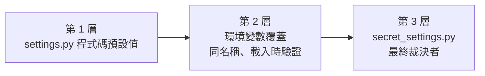

# 設定與環境變數

本專案的部署設定有三層機制。本文件是唯一的完整模型說明：圖示優先順序、目前所有「活的」環境變數清單（含型別、預設值、驗證規則）、哪些值必須留在 `secret_settings.py`，以及把未來某個設定變成可用環境變數覆蓋的步驟。

美術生成（`ART_SD_*`）參照表見 [提示詞資料庫](/gm/prompts)；容器編排細節見 [維運與驗證](/gm/operations)。

## 三層設定與優先順序



優先順序：`程式碼預設值 < 環境變數 < secret_settings.py`。

1. **`server/conf/settings.py` 預設值** — 所有設定的來源與文件。
2. **環境變數覆蓋** — 下表列出的變數在 settings 匯入時被讀取、轉型、驗證。變數不存在（或 typed／布林／URL knob 存在但為空白）時使用預設值。
3. **`server/conf/secret_settings.py`** — 在 settings.py 匯入之後才載入，因此永遠是最終裁決者。這是私密值（`SECRET_KEY` 等）唯一核准的位置；即使環境裡有繼承來的骯髒變數，它也是逃生氣閘。

失敗語意（fail-closed）：**存在但無效**的值會在 settings 匯入時丟出 `ImproperlyConfigured`，錯誤訊息包含變數名稱、引號括住的原始值、以及被違反的規則，例如：

```text
django.core.exceptions.ImproperlyConfigured: setting ART_SD_STEPS: invalid environment value 'twelve' (expected a positive integer)
```

絕對不會靜默退回預設值、clamp 或延後到第一次使用時才報錯。

## 本變更提供的 25 個環境變數（加上 SD_WEBUI_BASE_URL）

`ART_SD_BASE_URL` 的變數名稱由 `internal-art-worker` 規格固定為 `SD_WEBUI_BASE_URL`；其餘變數與設定同名。

### sd-webui 生成參數與資源上限

| 設定 | 環境變數 | 型別 | 預設值 | 驗證規則／說明 |
| --- | --- | --- | --- | --- |
| `ART_SD_BASE_URL` | `SD_WEBUI_BASE_URL` | URL 字串 | `http://127.0.0.1:7860` | 自由文字；空白＝使用預設值 |
| `ART_SD_TIMEOUT_SECONDS` | `ART_SD_TIMEOUT_SECONDS` | 整數 | `600` | 正整數（拒絕 0 與負數）；單次 txt2img 交換的牆鐘預算 |
| `ART_SD_STEPS` | `ART_SD_STEPS` | 整數 | `30` | 正整數（拒絕 0 與負數） |
| `ART_SD_CFG_SCALE` | `ART_SD_CFG_SCALE` | 浮點數 | `7.0` | 正浮點數（拒絕 0、負數、NaN／inf） |
| `ART_SD_SAMPLER` | `ART_SD_SAMPLER` | 自由文字 | 空字串 | 空＝sd-webui 伺服器預設；設定後必須與伺服器列舉完全一致 |
| `ART_SD_SCHEDULER` | `ART_SD_SCHEDULER` | 自由文字 | 空字串 | 空＝sd-webui 伺服器預設 |
| `ART_SD_CHECKPOINT` | `ART_SD_CHECKPOINT` | 自由文字 | 空字串 | 空＝伺服器現用模型；確切標題（含 hash 後綴） |
| `ART_SD_STYLES` | `ART_SD_STYLES` | 自由文字 | 空字串 | 逗號分隔風格名稱清單；空＝請求省略該欄；名稱逐字通過，需與 `@art options styles` 列舉一致 |
| `ART_SD_MODULES` | `ART_SD_MODULES` | 自由文字 | 空字串 | 逗號分隔 Forge 模組檔名清單；空＝請求省略該欄；僅適用 Forge 分支（附固定 dtype 伴隨欄位） |
| `ART_SD_SCENE_WIDTH` | `ART_SD_SCENE_WIDTH` | 整數 | `1344` | 正的 8 倍數（SDXL contract） |
| `ART_SD_SCENE_HEIGHT` | `ART_SD_SCENE_HEIGHT` | 整數 | `768` | 正的 8 倍數（SDXL contract） |
| `ART_SD_PORTRAIT_WIDTH` | `ART_SD_PORTRAIT_WIDTH` | 整數 | `768` | 正的 8 倍數（SDXL contract） |
| `ART_SD_PORTRAIT_HEIGHT` | `ART_SD_PORTRAIT_HEIGHT` | 整數 | `1024` | 正的 8 倍數（SDXL contract） |
| `ART_SD_MAX_RESPONSE_BYTES` | `ART_SD_MAX_RESPONSE_BYTES` | 整數 | `52428800`（50 MiB） | 正整數 |
| `ART_SD_MAX_IMAGE_DIMENSIONS` | `ART_SD_MAX_IMAGE_DIMENSIONS` | 整數 | `4096` | 正整數；解碼 PNG 邊長上限 |
| `ART_SD_MAX_IMAGE_PIXELS` | `ART_SD_MAX_IMAGE_PIXELS` | 整數 | `16777216`（16 MiP） | 正整數；總像素上限 |
| `ART_SD_PREPIN_SAMPLES_FORMAT` | `ART_SD_PREPIN_SAMPLES_FORMAT` | 布林 | `False` | 布林字（1/true/yes/on／0/false/no/off，不分大小寫）；⚠️ 會永久修改共用伺服器持久預設 |
| `ART_SD_OUTPUT_FORMAT` | `ART_SD_OUTPUT_FORMAT` | 選擇 | `png` | 不分大小寫限於封閉集合 `png/webp/jpeg/avif`；集合外值（如 `heic`）啟動即失敗；決定本機轉換格式與庫存檔副檔名 |
| `ART_SD_OUTPUT_QUALITY` | `ART_SD_OUTPUT_QUALITY` | 整數 | `80` | 1 到 100 包含兩端（拒絕 0、負數、大於 100）；僅影響有損格式（webp/jpeg/avif）；png 為無損重存、完全忽略此值 |
| `ART_SD_PRESERVE_GENERATION_METADATA` | `ART_SD_PRESERVE_GENERATION_METADATA` | 布林 | `True` | 布林字（1/true/yes/on／0/false/no/off，不分大小寫）；True＝產出物嵌入 A1111 形狀的 parameters 文字（PNG 文字區塊 `parameters`——latin-1 內容走 `tEXt`、其餘走 `iTXt`，A1111 讀取時兩種都認；JPEG／WebP／AVIF EXIF UserComment），False＝可證明的零中繼資料（無 text chunk、EXIF、ICC）；兩種模式下伺服器端嵌入的文字／EXIF／ICC 一律不會留存 |
| `ART_SD_PROBE_TIMEOUT_MS` | `ART_SD_PROBE_TIMEOUT_MS` | 整數 | `5000` | 1000 到 60000 包含兩端（拒絕低於 1000 或高於 60000）；單次 samplers 探測的總預算；僅診斷用途 |
| `ART_SD_PROBE_CACHE_SECONDS` | `ART_SD_PROBE_CACHE_SECONDS` | 整數 | `300` | 5 到 3600 包含兩端（拒絕低於 5 或高於 3600）；探測判定可重複使用的最長秒數；`@art health` 一律強制重新探測 |

### 美術佇列排空控制

| 設定 | 環境變數 | 型別 | 預設值 | 驗證規則／說明 |
| --- | --- | --- | --- | --- |
| `ART_SCHEDULER_ENABLED` | `ART_SCHEDULER_ENABLED` | 布林 | `True` | 布林字（1/true/yes/on／0/false/no/off，不分大小寫）；False 時 ArtDrainScript 永不排空 |
| `ART_SCHEDULER_INTERVAL_SECONDS` | `ART_SCHEDULER_INTERVAL_SECONDS` | 整數 | `30` | 正整數；排空間隔（於 Script 建立時讀取） |
| `ART_SCHEDULER_LIMIT` | `ART_SCHEDULER_LIMIT` | 整數 | `4` | 正整數；每 tick 排空的待處理筆數 |

### Webclient 載入旗標

| 設定 | 環境變數 | 型別 | 預設值 | 驗證規則／說明 |
| --- | --- | --- | --- | --- |
| `ELOSERN_VUE_CLIENT` | `ELOSERN_VUE_CLIENT` | 布林 | `True`（Vue SPA） | 布林字（1/true/yes/on／0/false/no/off，不分大小寫）；設為假值後重啟＝文件記載的緊急回退到 legacy webclient |

驗證細節：布林只接受上述固定字彙表（`bool("False")` 會是 `True`，這正是需要字彙表的原因）；「正的 8 倍數」同時拒絕 0、負數與非倍數；空白值對 typed／布林／選擇／URL knob 等同未設定；五個自由文字 knob 分兩族——`ART_SD_SAMPLER`／`ART_SD_SCHEDULER`／`ART_SD_CHECKPOINT` 空白＝正當的「伺服器預設」值，`ART_SD_STYLES`／`ART_SD_MODULES` 空白＝請求省略對應欄位。

**衍生設定（不可直接設定）**：`ART_SD_OUTPUT_EXTENSION`（庫存檔副檔名：`png`→`.png`、`webp`→`.webp`、`jpeg`→`.jpg`、`avif`→`.avif`）在 settings 匯入的最後、`secret_settings` 匯入之後，由**有效**的 `ART_SD_OUTPUT_FORMAT` 經單一封閉映射計算。它不讀取任何環境變數、不出現在任何清單或 `.env.example`；環境或 `secret_settings.py` 對它的任何直接指派都會被無條件丟棄，因此格式與副檔名矛盾在構造上不可能發生。

**輸出格式切換程序**：改 `ART_SD_OUTPUT_FORMAT` 並重啟後，新生成以新格式寫入；既有資產仍以舊副檔名持續正確呈現與服務（媒體路由接受全部四種庫副檔名，presentation 驗證庫存身份而非比對現行設定），直到該主題被重新生成（GM 指令 `@art retry`／`@art requeue`）。切換本身不動任何既有檔案。

## 既有的應用層變數

| 環境變數 | 讀者 | 型別 | 預設值 | 說明 |
| --- | --- | --- | --- | --- |
| `OLLAMA_BASE_URL` | `world/ai/profiles.py` | URL 字串 | `http://127.0.0.1:11434`（compose：`http://host.containers.internal:11434`） | 所有 LLM 層的 OpenAI 相容端點；每層模型／溫度調校值放在 `LLM_PROFILES` |
| `PROMPT_ROOT` | `server/conf/settings.py` | 路徑字串 | `<GAME_DIR>/prompts` | 根內提示詞資料夾；僅 bare-metal／非標準佈局使用 |
| `WEBSOCKET_CLIENT_PROXY_PORT` | Evennia `general_context` | 整數 | `4002` | 前端可見的 websocket 埠覆寫（反代／埠重映射） |

## Evennia launcher／compose／建置變數（不在 settings.py）

| 環境變數 | 讀者 | 說明 |
| --- | --- | --- |
| `EVENNIA_SUPERUSER_USERNAME` / `EVENNIA_SUPERUSER_EMAIL` / `EVENNIA_SUPERUSER_PASSWORD` | Evennia launcher | 僅在資料庫全新時非互動建立 Account #1；缺 password 會在容器內崩潰迴圈 |
| `PROMPTS_DIR` | compose.yaml | 宿側唯讀掛載點 → `/app/prompts` |
| `CONTAINER_UID`、`IMAGE_TAG`、`VERSION`、`RELEASE` | compose.yaml／Containerfile | 建置 ARG 與 OCI 標籤 |
| `TEST_DB_PATH` | Evennia `settings_default` | 測試資料庫名預設；本專案的 test_settings 無條件覆寫，實際上無效 |

## 測試／harness 變數

| 環境變數 | 讀者 | 說明 |
| --- | --- | --- |
| `MUD_TEST_SETTINGS` | `server/conf/test_settings.py` | 必須為 `1` 且 argv 以 `test` 開頭才允許匯入 |
| `DJANGO_SETTINGS_MODULE` | Evennia launcher／Django | 由啟動器自動設定 |
| `OPENSPEC_TEST_EVIDENCE`、`COVERAGE_FILE` | `tools/spec_traceability`／CI | 追溯證據與覆蓋率資料檔（quality-gate workflow 設定） |
| `ELOSERN_BROWSER_*` | `web/tests/browser/` | 受管理瀏覽器測試 harness 的隔離根、埠、身分、場景開關 |

**測試隔離**：`server/conf/test_settings.py` 在 star-import 生產 settings 之前會把上面所有環境覆蓋名稱從 `os.environ` 中 pop 掉，因此開發者或 CI runner shell 裡繼承的 `ART_SD_*` 值永遠不會影響測試跑的有效設定（有效值恰為程式碼預設值）。

## 必須留在 secret_settings.py 的內容

| 項目 | 為什麼不走環境 |
| --- | --- |
| `SECRET_KEY` 等 Django 私密、`ALLOWED_HOSTS` | 環境變數會洩漏進程序清單與 `compose inspect`；`secret_settings.py` 是唯一核准的位置 |
| `LLM_PROFILES` 每層調校 | 規格 `llm-profiles` 範圍；結構化的每層調校值不適合塞進單一環境變數 |
| `ART_SD_CLIENT` | 這是會執行匯入的 dotted path；環境可控制的匯入縫等於讓任何繼承環境在引擎啟動時匯入任意程式碼（匯入注入） |
| `ART_STORE_ROOT` | 環境打字錯誤會把生成美術靜默搬到持久卷之外的路徑；罕見的非標準佈局請在 `secret_settings.py` 明確設定 |
| `ART_SD_USERNAME`／`ART_SD_PASSWORD` | 這是憑證；環境變數會洩漏進程序清單與 `compose inspect`。客戶端只在兩者皆非空時送出 Basic auth；密碼永不出現在任何記錄 |

## Bare-metal（非容器）設定步驟

本專案的 Python 端**不自動載入 `.env`**（無新相依；compose 已為容器路徑注入 `.env`）。裸機執行時在 shell 匯出：

```sh
export ART_SD_STEPS=12
export SD_WEBUI_BASE_URL=http://gpu.lan:7860
uv run --locked evennia start
```

建議用 direnv／dotenv 工具或 systemd `EnvironmentFile=` 管理，名稱與 `.env.example` 一致。

## 套用規則：重啟／reload

設定只在行程啟動時讀取。改環境變數後：

```sh
uv run --locked evennia reload   # 或 evennia stop && evennia start
```

容器：`podman compose up -d --force-recreate evennia`。

## 讓未來的設定可用環境變數覆蓋（4 步驟）

1. 在 `server/conf/settings.py` 用 `_env_str`／`_env_int`／`_env_int_bounded`／`_env_float`／`_env_bool`／`_env_dimension`（或 `_env_typed`）指派該設定。
2. 在 `.env.example` 新增附註解的範列（說明型別、預設值、界線；typed knob 絕不出現未註解的空值條目）。
3. 在 `docs/development/settings-and-environment.md` 與（若適用）`docs/gm/prompts.md` 補表格列。
4. 在 `server/conf/tests/test_env_overrides.py` 補一筆有效值 case 與無效值 case，並在 `server/conf/test_settings.py` 的 `_ENV_OVERRIDES` 加入名稱——清單同步由該模組的 AST 盤點測試強制。

## 疑難排解

| 症狀 | 原因與解法 |
| --- | --- |
| 啟動時 `ImproperlyConfigured: setting <NAME>: invalid environment value '<raw>' (<rule>)` | 該環境變數值無效。**所有**匯入這些 settings 的 Evennia 程序（portal 與 server 皆然）都會無法啟動——關閉美術排程器無法救援。解法：改正或 unset 該變數後重啟。compose 環境檢查 `podman compose config` 與容器日誌。 |
| `.env` 裡留著空白的 `VAR=` | typed／布林／URL knob 視為未設定（用預設值）；自由文字 knob 取其正當的「伺服器預設」空值。Podman 會把未註解的空值原樣傳進容器，這是文件化行為。 |
| 測試結果疑似受 shell 環境影響 | 不該再發生：test settings 會 pop 所有覆蓋名稱。若仍見到，檢查是否用了未 sanitized 的 settings 模組並回報。 |
| `@art health` 顯示 `server: unreachable` 但生成仍成功 | 正常：health 探測僅診斷，unreachable 判定永不阻擋佇列、跳過或延後任何工作（伺服器正在恢復時就會出現這種短暫時差）。生成嘗試不受 `ART_SD_PROBE_*` 影響。 |
| 想知道某個變數是否真的被讀取 | `server/conf/tests/test_env_overrides.py` 的 AST 盤點測試保證 `.env.example` 每個 active 條目都有真實讀者；死變數會讓該測試失敗。 |
