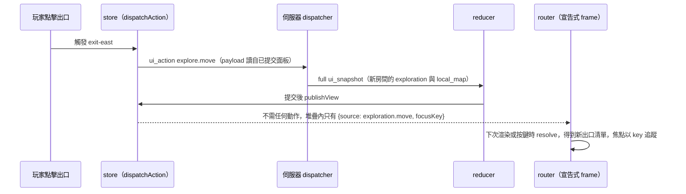

# 宣告式框架重新整理 — Web 客戶端 UI 集中更新設計

**Date:** 2026-09-02
**Status:** Approved
**Scope:** Vue 3 SPA 客戶端鍵盤路由器的 frame 模型（`web/webclient-app/`、`web/static/webclient/js/elosern/`）。伺服器、OOB 協定、玩家命令面皆不變。

伺服器端在每個命令與每個按鈕動作結束後，都已經推播最新面板，斷裂只發生在客戶端最後一哩。鍵盤路由器的 frame 儲存的是開框當下的面板資料副本，而重建閘門又只看根選單簽名，根選單不隨房間變動，所以開著的子選單永遠不會更新。修法是把 frame 改為宣告式，frame 只存描述符（descriptor）與焦點鍵，內容每次使用時都從已提交（commit）的面板推導，整類過期 frame 的 bug 自此不會成立。

---

## 1. 問題現象

玩家在「移動」子選單按出口按鈕後，角色確實移動，但子選單仍顯示上一個房間的出口。再按一次時送出的是舊 payload，伺服器以「你的位置已經改變，請重新操作。」或「這裡沒有這個出口。」拒絕，不會移動。

同類斷裂涵蓋所有被 push 進堆疊的 frame，包括移動/查看/互動/等待子選單、互動目標與腳本關鍵詞選單、商店/任務抽屜的 frame、戰鬥的技能/威力/目標 frame。直接讀取已提交狀態的面板（狀態條、小地圖格點、美術、敘事流、建議卡片）則正常更新。

## 2. 根因（已驗證）

伺服器端的集中機制是健全的。

- version-1 OOB 協定在每個文字命令結算後推完整 `ui_snapshot`（`server/conf/inputfuncs.py` 的 `text` → `ingress.observe_command_settlement`），也在每個 `ui_action` 完成後推播，被拒絕時同樣推（`web/webclient/actions/dispatcher.py` 的 `_publish_completion`。`explore.move` 宣告 `AFFECTED_FULL = ()`，語意為 full snapshot，見 `exploration_actions.py`）。
- 客戶端 reducer（`web/static/webclient/js/elosern/protocol.js`）以原子方式提交快照並通知訂閱者，`buildView()` 每次 publish 都從已提交狀態重新推導各面板綁定切片。

斷裂點在最後一哩。`KeyboardRouter` 的 frame 形態是 `{menu, focusRow, focusCol}`，等於開框當下面板資料的凍結副本。唯一的重建鉤鉤 `rebuildFocusMenu()`（`stores/elosern.js`）以「根 items 的簽名」作為閘門，而探索根選單（移動/查看/互動/角色/任務/背包/等待/建議）不隨房間變動，於是移動後 `exploration` 面板雖然已提交更新、簽名卻沒變，鉤鉤直接 early-return，開著的子 frame 從不重建。即使鉤鉤觸發，`router.replaceMenu()` 也只是把堆疊「頂部 frame」蓋成根 items，這是附帶的第二個缺陷，開著的子選單無法原地更新、只會被蓋掉。`lastMenuSig` 這類簽名閘門屬於同一失效模式，本設計將其從架構中移除。

## 3. Evennia 標準做法（以安裝的 Evennia 6.1.0 原始碼查證）

Evennia 沒有標準的伺服器推播面板更新協定。隨附的 Web 客戶端提供的是下列機制。

| 機制 | 來源 | 性質 |
|---|---|---|
| 文字流（GAG lines） | `plugins/default_in.js`、`default_out.js` | 每個命令的輸出，重新整理即重印 |
| 單行 `prompt` | `default_out.js` | 一行狀態槽 |
| 泛用 OOB 派發 | `evennia.js`（`listeners[cmdname]`，無則 `default`） | 僅負責路由，重新整理語意由遊戲自己的 JS 決定 |
| 客戶端對話框工具 | `plugins/popups.js` | 純本機，無伺服器驅動的內容更新 |
| 行內可點擊按鈕 | `plugins/hotbuttons.js` | 靜態、客戶端自訂 |

最接近標準的模式是 `EvMenu`。每個互動後伺服器重發整個動態區塊，客戶端整塊替換。既有的 `ui_snapshot` / `ui_update` 加上 epoch/revision 協定，正是這個模式的正式化版本。結論在於協定維持原樣，只修客戶端最後一哩的契約。

## 4. 決策

### D1 — 宣告式 frame（採用）

每個 frame 只存描述符與焦點鍵。

```
frame := { descriptor: {source: string, params: object}, focusKey: string|null }
```

frame 的任何消費端（渲染、導航、submit）都透過 store 注入的 `resolve(descriptor) → menu`，在使用當下從已提交面板推導。客戶端可變的持久狀態縮減為描述符堆疊與焦點/選取鍵，選單資料只存在於已提交快照一處。這把 store 既有不變量 D2（「訂閱者只看到已提交狀態」）延伸到原本違反它的 frame 層，過期 frame 的整類 bug 自此在架構層面不可能發生，未來新面板只需新增一個解析來源，不需要撰寫刷新邏輯。

### D2 — 拒絕：全樹簽名＋原地重建

把 `replaceSuggestionsFrameInPlace` 一般化成「每種 frame 一套重建器」，並把簽名閘門擴大到整棵選單樹。改動較小、可按表面漸進上線，但移動/查看/互動/目標/關鍵詞/服務/確認/戰鬥/建角每種 frame 各需一套重建加焦點重映射邏輯，資料副本與事後補丁的雙重追蹤仍然存在，且依賴簽名作廢判斷持續正確，而簽名判斷失誤正是本次的失效模式。

### D3 — 拒絕：只補移動路徑

`explore.move` 成功後把堆疊退回根選單。成本最低，但查看/互動/等待/目標/關鍵詞/服務/戰鬥 frame 的同類過期問題保留，與集中機制的目標相違背。

## 5. 設計

### 5.1 焦點追蹤

- frame 存 `focusKey`（item 的 `key`，例如 `exit-<ref>`、`target-<id>`、`keywords-<id>`、`attack`、`scale-1`）。每次解析後，焦點落在同 key 項目的新幾何位置，grid/list 的 row/col 由解析結果重算。
- key 消失時移到最近存活列（index 序，等距取較前列），與 `replaceSuggestionsFrameInPlace` 的既有規則一致，並將其一般化。
- 空選單時 focus 為 null。
- 任何 confirm（keyboard 或 `source: "pointer"`）都把該 item 的 key 寫回 frame 的 `focusKey`。
- 新 push 預設聚焦第一項，等於現行 `focusRow = 0` 行為。

### 5.2 本機選取態（ephemera）

全部維持在 frame 資料之外，且各有唯一所有者。

| 狀態 | 所有者 | 宣告式化後 |
|---|---|---|
| 戰鬥 skill/page/威力/AREA 候選 | `combat` model | `combat.*` 描述符的 resolve 繼續走既有 `CombatMenu.rebuildForPanel(combat, panel, previous)`，選取保留語意不變 |
| 互動目標選取 | `lastTarget` 變數與 frame 資料副本，屬雙軌記錄 | 刪 `lastTarget`，目標/關鍵詞描述符自帶 `{identity}`，細節行與麵包屑直接讀堆疊上的描述符（單一根資料源） |
| 商店數量表單 | `quantityForm`（本機狀態） | 不變，維持「services 面板被取代即丟棄」的既有契約（spec `webclient-service-menus`） |
| 建角精靈 stage 與確認 | `creation` model，confirm items 目前是陣列副本 | `creation.confirm` 描述符帶 `{kind, presetKey}`，items 每次由已提交 `creation` 面板解析生成，伺服器 authored 文字自動跟新 |

### 5.3 解析失敗降級，軟性處理、永不自動 pop

- 描述符解析不到資料（面板缺件或不可用，例如換房後的舊 `target-42`）時，resolve 回傳「單一 disabled 說明項」選單，內容優先使用伺服器作者的 `reason.message`，沒有則用本機備援字串「畫面狀態已更新，請返回上層」。disabled 項目原本就可聚焦、不可提交，與現行語意一致。
- resolve 擲出例外時一律捕捉並降為同款選單，文字遊玩與敘事流不受影響。
- 面板更新永不 pop 或 re-home 堆疊。`rehomeFrame` 經 `replaceMenu` 蓋掉頂部 frame 的病根，隨著宣告式 frame 一併消失，frame 內容在使用當下推導，「何時該重建」的問題不復存在。

### 5.4 堆疊 teardown（唯一會重置堆疊的事件集）

mode 切換（exploration ↔ combat ↔ creation）、presentation epoch 重置、transport 中斷、no-puppet 脫附時執行 `router.reset([{source: <新模式>.root}])`。驅動點沿用 `syncHudDrawer` 現有 teardown 的事件集合，維持單一決策點。堆疊自此恆非空，現行「空堆疊 re-home 保險絲」（包裹 `router.reset` 的 `stores/elosern.js` 約 202-215 行）刪除。

### 5.5 架構與資料流



元件劃分如下。

1. `web/static/webclient/js/elosern/keyboard_router.js`（既有 UMD 模組，隨其 Node gate 就地演進）：frame 改為 `{descriptor, focusKey}`，`createRouter({resolve})` 注入 store 的解析器，`push(descriptor)`、`popMenu`、`escape`、`trail()`、`rootMenu()`、`currentMenu()`、幾何計算（`itemAt`、`move`）與 `confirm()` 全部對 `resolve(descriptor)` 結果操作。
2. `web/webclient-app/stores/elosern.js`：實作描述符到 builder 的解析註冊表，後端沿用既有 `ExplorationMenu` / `ServiceMenu` / `CombatMenu` / `CreationMenu` 模型。約 20 個 push 點改為描述符，並刪除 `rebuildFocusMenu`、`rehomeFrame`、`lastMenuSig` / `lastSuggSig` 等簽名閘門、`replaceSuggestionsFrameInPlace`、`dockRawByKey` 手動同步與包裹版 `router.reset`。`view.combatMenu` / `view.rootMenu` / `view.dockTrail` 改為宣告式堆疊的派生結果（items 形態不變，元件端零改）。
3. 伺服器端零改動。

第一波解析來源為 `exploration.root|move|look|interact|wait|target-<id>|keywords-<id>|suggestions`、`services.<surface>` 與受托管的抽屜 frame、`services.confirm-<kind>`、`combat.root|categories|forfeit|scale|target`、`creation.<stage>|confirm`。互動目標系 frame 以 `{identity}` 為鍵，每次從已提交 `exploration` 面板重新解析，目標消失時依 §5.3 降級。

### 5.6 派發即時性

frame 在使用當下派生後，`explore.move` 的 payload（`exit_ref` 加 `current_node`）於派發時讀自已提交面板，舊 payload 的錯誤序列在使用者介面上不可達。伺服器端 `stale_location` 守衛（`exploration_actions.py:311`）保留為多工作階段與事件競態的後盾，`base_revision` 受理閘門（`dispatcher.py:216`）不變。

## 6. 遷移範圍

1. `web/static/webclient/js/elosern/keyboard_router.js`：宣告式化，同 commit 更新 Node gate 的 `web/static/webclient/js/tests/keyboard_router.test.js`、`ui_contract.test.js`、`hud_dock_menus.test.js`。
2. `web/webclient-app/stores/elosern.js`：解析註冊表、push 點轉換，刪除清單見 §5.5 第 2 項。
3. 元件層（`DockMenu.vue`、`ActionDock.vue`、`DockMenuItem.vue`、`DockBreadcrumb.vue`、`AppClient.vue` 的抽屜 frame 承載）：items 形態不變，預期零改動或僅動綁定來源。
4. `web/webclient-app/tests/` 的 Vitest 套件與 `stories/fixtures.js`：frame 形態 fixtures 與 store 同 commit 更新。
5. OpenSpec：開一個 change，在 main spec 新增「派生 frame 即時性」契約需求，並以 `tools.spec_traceability` 的 `covers_requirement` 標註在對應行為測試。無玩家命令增刪改名，`docs/game/commands.md` 不動。

## 7. 驗證

1. 先重現。沿用既有 browser 探索 fixture（三出口南門 move frame，commit `1de5d1d`）擴寫失敗回歸測試，開「移動」後按出口，斷言清單為新房間出口，現行碼必失敗即同時確認根因。
2. 實施後轉綠，本機 browser 驗證控制在單一 class 預算內。
3. 閘門依序為 `node --test web/static/webclient/js/tests/*.test.js`（無相依 Node gate）、`npm test`（Vitest）、`uv run --locked python -m tools.spec_traceability check`。完整 managed browser 套件與 `tools.spec_traceability verify --evidence` 維持 CI 所有。
4. Vitest 的 store 層回歸包含三項，開 Move frame 時快照提交則清單更新且焦點以 key 追蹤、目標 identity 消失則降為不可用且堆疊不動、mode 切換則以根描述符 teardown。

驗收標準是任何已提交面板更新後，開著的每個 frame 在下一次渲染或按鍵時必然反映已提交內容，且客戶端程式碼中不存在任何 frame 專屬的刷新函式。

## 8. 非目標

- 協定或伺服器推播路徑變更。「每個動作後推 full snapshot」已是 EvMenu「整塊重發」模式的實作，affected-panel 微最佳化不在本期。
- 舊 AJAX 客戶端行為。
- 第二個客戶端狀態 store 或事件匯流排。
